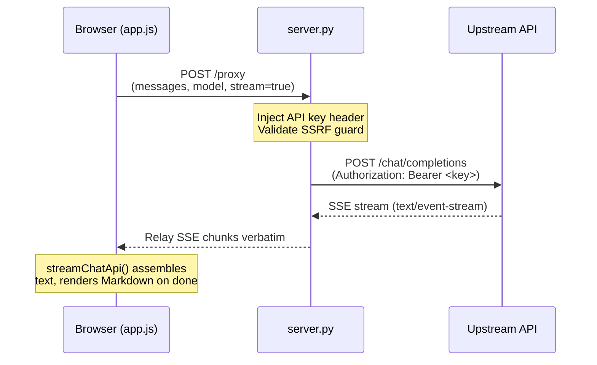
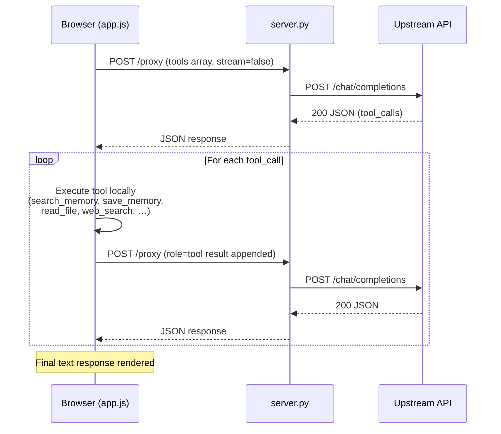

# Architecture — USAi Chat

> **Scope: USAi Chat application (concern #1 only).**  
> For the dev-harness layout see [`docs/ORGANIZATION.md`](ORGANIZATION.md).  
> For engineering principles see [`docs/principles.md`](principles.md).  
> For the RAIL dev pipeline see [`docs/rail-pipeline.md`](rail-pipeline.md).

---

## 1. System overview

USAi Chat is a **static vanilla-JS frontend** (`index.html` + `app.js` + `styles.css`)
served by a **small Python stdlib backend** (`server.py`). There is no build step, no
framework, and no runtime dependencies beyond `python-dotenv`.

```
┌────────────────────────────────┐
│  Browser  (index.html / app.js)│
└───────────────┬────────────────┘
                │  HTTP  (localhost)
┌───────────────▼────────────────┐
│  server.py  (Python stdlib)    │
│  • Serves static files         │
│  • Proxies chat to upstream    │
│  • Local persistence endpoints │
└───────────────┬────────────────┘
                │  HTTPS
┌───────────────▼────────────────┐
│  Upstream OpenAI-compatible API│
│  (BASE_URL — configurable)     │
└────────────────────────────────┘
```

**Key design constraints** (see [`docs/principles.md`](principles.md) for full rationale):
- Minimal, audited **runtime** surface — vanilla JS + Python stdlib + `python-dotenv` only.
- API key injected **server-side**; never sent to or stored in the browser.
- Container-deployable via `Dockerfile` / `docker-compose.yml`; one-word entry points
  via `Makefile`.

---

## 2. Request flow

### 2a. Chat request (streaming)



### 2b. Tool-calling loop



---

## 3. Backend — `server.py`

### 3a. Request handler pattern

`EnvConfigHTTPRequestHandler` extends `http.server.BaseHTTPRequestHandler`.
Each HTTP verb dispatches through a **`routes` dict** that maps URL paths to
`_handler` methods:

```python
# do_GET example (simplified)
routes = {
    '/config':        self._get_config_handler,
    '/models':        self._get_models_handler,
    '/sessions':      self._get_sessions_handler,
    '/memory/list':   self._get_memory_list_handler,
    '/memory/search': self._get_memory_search_handler,
    '/memory/read':   self._get_memory_read_handler,
    '/logs':          self._get_logs_handler,
    '/chunk-cache':   self._get_chunk_cache_handler,
}
```

Unmatched paths fall through to `SimpleHTTPRequestHandler` (static file serving).

### 3b. Endpoint catalog

| Method | Path | Purpose |
|--------|------|---------|
| `GET` | `/config` | Non-secret config + `has_api_key` / `has_context7` / `has_obsidian` flags |
| `GET` | `/models` | Proxied model list from upstream |
| `GET` | `/sessions` | List archived chat sessions |
| `GET` | `/memory/list` | List Obsidian memory notes |
| `GET` | `/memory/search` | Full-text search across memory notes |
| `GET` | `/memory/read` | Read a single memory note |
| `GET` | `/logs` | Tail the in-memory log buffer |
| `GET` | `/chunk-cache` | List cached file chunks |
| `POST` | `/proxy` | Proxy chat completions to upstream (streaming + non-streaming) |
| `POST` | `/context7` | Proxy Context7 documentation queries |
| `POST` | `/memory/save` | Save a new Obsidian memory note |
| `POST` | `/sessions` | Archive current session; start a new chat |
| `POST` | `/chunk-cache` | Store file chunks server-side |
| `DELETE` | `/sessions/{id}` | Delete an archived session |
| `DELETE` | `/chunk-cache` | Clear chunk cache |

### 3c. Config loading

`load_config()` reads `.env` via `python-dotenv` and populates the global `CONFIG`
dict. Fields returned to the browser via `/config` are **non-secret only**:
`base_url`, `default_model`, `default_system_prompt`, `has_api_key` (bool),
`has_context7` (bool), `has_obsidian` (bool), and a handful of UI defaults.
`api_key` and `context7_api_key` are injected server-side on every proxy request
and **never reach the browser**.

### 3d. Persistence — on-disk stores

| Store | Path | Format | Purpose |
|-------|------|--------|---------|
| Active chat | `chat_history.json` | JSON array | Current conversation (persists across page reloads) |
| Archived sessions | `.chat_sessions/<id>.json` | JSON | Saved chat sessions |
| File chunks | `.chunk_cache/` | JSON files | Per-file text chunks for RAG |
| Obsidian memory | `<OBSIDIAN_VAULT_PATH>/<OBSIDIAN_MEMORY_SUBDIR>/memories/` | Markdown | Long-term memory notes with YAML frontmatter |

### 3e. Logging

`add_log(level, msg)` appends to an in-memory `LOGS` list (capped at 500 entries)
and writes to `stderr`. Log level, component tag, and timestamp are included.
Secrets are never logged. Accessible via `GET /logs`.

---

## 4. Frontend — `app.js`

### 4a. Module structure

`app.js` is a single vanilla-JS file that runs in the browser. A
`if (typeof module !== 'undefined') module.exports = {...}` guard at the bottom
exports pure helper functions for `node --test` unit testing without
a build step.

### 4b. Tool registry

Tools are declared in `TOOL_REGISTRY` (a plain object) and gated at runtime
by `getEnabledTools()`:

| Tool name | Requires | Description |
|-----------|----------|-------------|
| `search_memory` | Obsidian vault + Memory toggle | Full-text search of vault notes |
| `save_memory` | Obsidian vault + Memory toggle | Save a new memory note to the vault |
| `read_file` | File uploads present | Read content of an uploaded/chunked file |
| `web_search` | *(not yet wired to a backend)* | Placeholder |
| `context7_search` | Context7 API key + toggle | Query Context7 documentation |

`getEnabledTools()` filters `TOOL_REGISTRY` entries against the current config and
UI toggle states, returning an array suitable for the OpenAI `tools` parameter.

### 4c. Chat API paths

```
sendMessage()
  ├─ tools enabled? → runWithTools()       # non-streaming tool loop
  └─ stream enabled? → streamChatApi()     # SSE streaming
                    → callChatApi()        # non-streaming single call
```

- **`streamChatApi()`** — opens an `EventSource`-style `fetch` with
  `AbortController`; relays SSE chunks to the bubble in real time; runs
  `renderMarkdown()` on the final assembled text.
- **`callChatApi()`** — single `fetch` POST; parses JSON response.
- **`runWithTools()`** — iterates: call API → if `finish_reason === 'tool_calls'`,
  execute each tool locally, append `role: 'tool'` results, call again. Terminates
  on `finish_reason === 'stop'` or when the tool loop limit is reached.

### 4d. RAG / file chunking

Uploaded files are chunked by `chunkText()` (sliding-window, configurable size and
overlap) and stored server-side via `POST /chunk-cache`. At message-build time,
`getRelevantChunks()` scores chunks against the current query using
`scoreChunkByKeywords()` (TF-style keyword overlap) and injects the top-N as
`role: 'user'` context messages via `prepareContextMessages()`.

### 4e. Obsidian memory integration

- **Auto-recall** (opt-in toggle): `prepareContextMessages()` calls
  `GET /memory/search` with the current user message; top-N matching notes are
  injected as a system-level context block before the conversation. A
  `Memory: N note(s)` segment is appended to the context note shown in the UI.
- **Manual 💾 button**: `saveMemory()` posts the selected message text to
  `POST /memory/save` with tag `manual`.
- **`save_memory` / `search_memory` tools**: the model can save/recall memories
  autonomously when tools are enabled.

### 4f. Sessions

- **`archiveCurrentSession()`** — POSTs `POST /sessions` to archive the current
  `chat_history.json` snapshot with a title/timestamp; clears the active chat.
- **`restoreSession(id)`** — loads a saved session JSON, rebuilds
  `conversationHistory` and re-renders `chatDisplayHistory`.
- **`showSessionsList()`** — fetches `GET /sessions` and renders the sidebar
  history list.

### 4g. Settings persistence

`saveSettings()` / `restoreSettings()` persist UI state to `localStorage` under
the key `usai.settings.v1`. Persisted fields include: model (+ custom URL),
system prompt, temperature, max tokens, reasoning effort, stream/tools/JSON/
Context7/auto-recall toggles, JSON schema, chunk size, top chunks, and base URL.
Settings are restored after `loadConfig()` + `loadModels()`, with dependent UI
(schema box, stream-disable, Context7 button) re-synced.

### 4h. Markdown rendering

`renderMarkdown(text)` is a dependency-free, XSS-safe renderer:
1. HTML-escapes the raw text first.
2. Whitelists a fixed set of Markdown constructs (fenced code, inline code, bold,
   italic, headings, unordered + ordered lists, blockquotes, horizontal rules,
   links).
3. Returns an HTML string safe for `innerHTML` assignment.

Streaming renders plain text mid-stream; `renderMarkdown()` is applied only on
stream completion.

---

## 5. Security architecture

| Concern | Mechanism |
|---------|-----------|
| API key secrecy | Key stays in `server.py`; injected as `Authorization` header server-side; `/config` returns only `has_api_key` bool |
| Path traversal | All filesystem endpoints (`/memory/*`, `/sessions`, `/chunk-cache`) validate that the resolved path stays within the intended root folder |
| SSRF | `is_safe_upstream_url()` rejects non-`http(s)` schemes and private/loopback ranges before any upstream fetch |
| Secret scanning | `scripts/security-scan.sh` runs `gitleaks` on every non-trivial change |
| SAST | `bandit` scans `server.py` in the same script |
| Dependency CVE | `pip-audit` checks `requirements.txt` in the same script |

---

## 6. Infrastructure & runtime environment

| Artifact | Purpose |
|----------|---------|
| `Dockerfile` | Reproducible container image (Python + app files, no build step) |
| `docker-compose.yml` | One-command local run with env-file mount |
| `Makefile` | `make run`, `make test`, `make scan`, `make check` entry points |
| `.env` / `.env.example` | Runtime config contract; `.env.example` is drift-tested |
| `.venv/` | Local Python venv (managed by `install_dependencies()` at startup) |

Start the server:
```bash
.venv/bin/python server.py   # then open http://localhost:8000
```
Or with Docker:
```bash
docker compose up
```

---

## 7. Related documents

| Document | What it covers |
|----------|---------------|
| [`docs/ORGANIZATION.md`](ORGANIZATION.md) | The three-concern map (app / Continue harness / Cline harness) |
| [`docs/principles.md`](principles.md) | Why: minimal runtime surface, DevSecOps, IaC, Agile |
| [`docs/rail-pipeline.md`](rail-pipeline.md) | How we build: RAIL roles, TDD, coverage gates |
| [`docs/USER_GUIDE.md`](USER_GUIDE.md) | End-user features and usage |
| [`docs/specs/`](specs/) | Per-feature design specs |
| `README.md` | Setup, quick-start, test commands |
