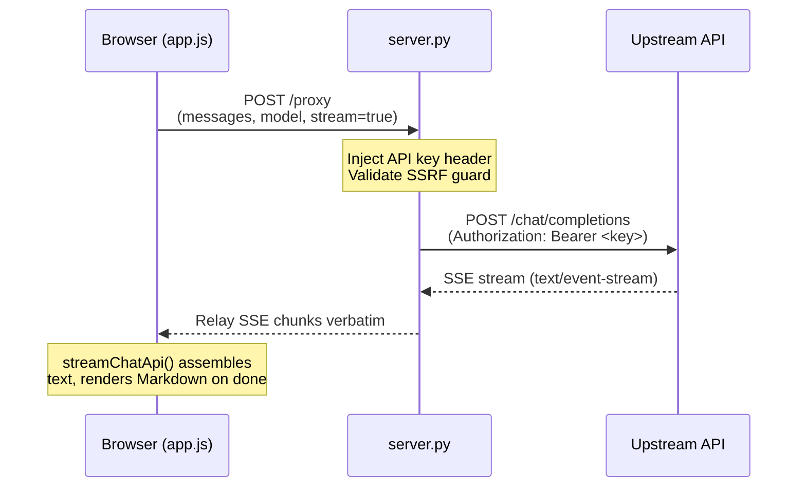
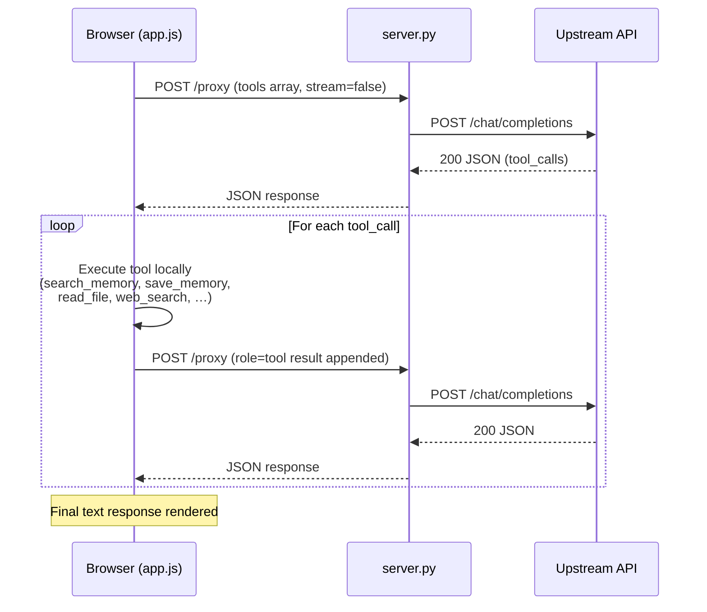
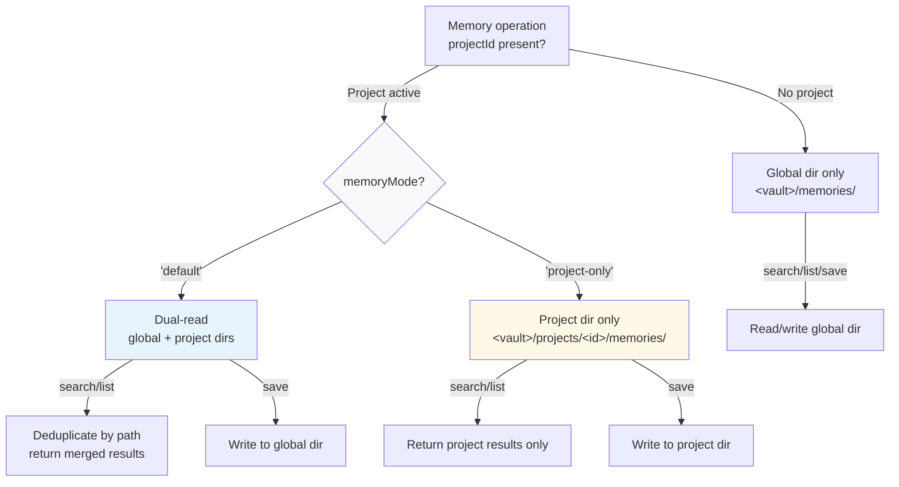

# Architecture — USAi Chat

> **Scope: USAi Chat application (concern #1 only).**  
> For the dev-harness layout see [`docs/ORGANIZATION.md`](ORGANIZATION.md).  
> For engineering principles see [`docs/principles.md`](principles.md).  
> For the RAIL dev pipeline see [`docs/rail-pipeline.md`](rail-pipeline.md).

---

## 1. System overview

USAi Chat is a **static vanilla-JS frontend** (`index.html` + `app.js` + `styles.css`)
served by a **small Python stdlib backend** (`server.py`). There is no build step and
no framework. The only runtime dependencies are two approved, hash-pinned packages:
`python-dotenv` (`.env` loading) and `pypdf` (PDF text extraction).

```
┌────────────────────────────────┐
│  Browser  (index.html / app.js)│
└───────────────┬────────────────┘
                │  HTTP  (localhost)
┌───────────────▼────────────────┐
│  server.py  (Python stdlib)    │
│  • Serves static files         │
│  • Proxies chat to upstream    │
│  • Local persistence endpoints │
└───────────────┬────────────────┘
                │  HTTPS
┌───────────────▼────────────────┐
│  Upstream OpenAI-compatible API│
│  (BASE_URL — configurable)     │
└────────────────────────────────┘
```

**Key design constraints** (see [`docs/principles.md`](principles.md) for full rationale):
- Minimal, audited **runtime** surface — vanilla JS + Python stdlib + only two
  approved, hash-pinned backend packages (`python-dotenv`, `pypdf`; plus `pypdf`'s
  transitive `typing_extensions`). DOCX is read with stdlib `zipfile`/`xml.etree`
  rather than adding `python-docx`. See [`docs/principles.md`](principles.md) §1.
- API key injected **server-side**; never sent to or stored in the browser.
- Container-deployable via `Dockerfile` / `docker-compose.yml`; one-word entry points
  via `Makefile`.

---

## 2. Request flow

### 2a. Chat request (streaming)


```mermaid
sequenceDiagram
    participant B as Browser (app.js)
    participant S as server.py
    participant U as Upstream API

    B->>S: POST /proxy<br/>(messages, model, stream=true)
    Note over S: Inject API key header<br/>Validate SSRF guard
    S->>U: POST /chat/completions<br/>(Authorization: Bearer <key>)
    U-->>S: SSE stream (text/event-stream)
    S-->>B: Relay SSE chunks verbatim
    Note over B: streamChatApi() assembles<br/>text, renders Markdown on done
```

> **Relay implementation note.** The relay upgrades the response to HTTP/1.1 with
> `Transfer-Encoding: chunked` (HTTP/1.0 has no streaming framing, so `fetch()`
> would withhold every byte until connection close) and reads upstream bytes via
> `resp.fp.read1(n)`. `read1` is required on both counts: `resp.read(n)` blocks
> until it can return exactly *n* bytes (killing incrementality), while
> `resp.fp.raw.read(n)` bypasses the `BufferedReader` that `http.client` already
> used to parse the response headers — dropping any first SSE frame that arrived
> in the same TCP segment as those headers. See
> `ProxyFirstFrameNotDroppedTests` in `backend/tests/python/test_server_proxy.py`.

### 2b. Tool-calling loop


```mermaid
sequenceDiagram
    participant B as Browser (app.js)
    participant S as server.py
    participant U as Upstream API

    B->>S: POST /proxy (tools array, stream=false)
    S->>U: POST /chat/completions
    U-->>S: 200 JSON (tool_calls)
    S-->>B: JSON response
    loop For each tool_call
        B->>B: Execute tool locally<br/>(search_memory, save_memory,<br/>read_file, web_search, …)
        B->>S: POST /proxy (role=tool result appended)
        S->>U: POST /chat/completions
        U-->>S: 200 JSON
        S-->>B: JSON response
    end
    Note over B: Final text response rendered
```

---

## 3. Backend — `server.py`

### 3a. Request handler pattern

`EnvConfigHTTPRequestHandler` extends `http.server.BaseHTTPRequestHandler`.
Each HTTP verb dispatches through a **`routes` dict** that maps URL paths to
`_handler` methods:

```python
# do_GET example (simplified)
routes = {
    '/config':        self._get_config_handler,
    '/models':        self._get_models_handler,
    '/sessions':      self._get_sessions_handler,
    '/memory/list':   self._get_memory_list_handler,
    '/memory/search': self._get_memory_search_handler,
    '/memory/read':   self._get_memory_read_handler,
    '/logs':          self._get_logs_handler,
    '/chunk-cache':   self._get_chunk_cache,         # also accepts ?projectId=
    '/projects':      self._get_projects,            # Projects v1 (#27)
    '/mcp/vaults':    self._get_mcp_vaults,          # MCP bridge (#16 Ph2)
}

# do_POST example (simplified)
routes = {
    '/proxy':         self._proxy_api,
    '/sessions':      self._post_new_chat_session,
    '/chunk-cache':   self._post_chunk_cache,        # also accepts ?projectId=
    '/projects':      self._post_projects,           # Projects v1 (#27)
    '/memory/save':   self._post_memory_save,
    ...
}

# do_PUT dispatches to self._put_projects()  for PUT /projects/<id>
# do_DELETE dispatches to self._delete_projects() for DELETE /projects/<id>
```

Unmatched paths fall through to `SimpleHTTPRequestHandler` (static file serving).

### 3b. Endpoint catalog

| Method | Path | Purpose |
|--------|------|---------|
| `GET` | `/config` | Non-secret config + `has_api_key` / `has_context7` / `has_obsidian` / `has_projects` flags |
| `GET` | `/models` | Proxied model list from upstream |
| `GET` | `/sessions` | List archived chat sessions; accepts `?projectId=<id>` to filter by project (traversal-safe) |
| `GET` | `/memory/list` | List Obsidian memory notes (accepts `?projectId=` for project-scoped listing) |
| `GET` | `/memory/search` | Full-text search across memory notes (accepts `?projectId=` for project-scoped search) |
| `GET` | `/memory/read` | Read a single memory note |
| `GET` | `/logs` | Tail the in-memory log buffer |
| `GET` | `/logs/files` | List persisted log files; `?name=<name>` reads one (path-traversal guarded) |
| `GET` | `/raw-responses` | List raw API response capture metadata (newest-first) |
| `GET` | `/raw-responses?id=` | Read one full raw-response capture record |
| `DELETE` | `/raw-responses` | Clear all raw-response capture records |
| `DELETE` | `/raw-responses?id=` | Delete one raw-response capture record |
| `GET` | `/projects` | List all projects |
| `POST` | `/projects` | Create a new project (`{name, instructions?, memoryMode?}`) |
| `PUT` | `/projects/<id>` | Update project name, instructions, pinned state, or memoryMode |
| `DELETE` | `/projects/<id>` | Delete a project and cascade-delete its chunk cache; orphans chats to "Chats"; preserves Obsidian memory notes |
| `POST` | `/proxy` | Proxy chat completions to upstream (streaming + non-streaming) |
| `POST` | `/context7` | Proxy Context7 documentation queries |
| `POST` | `/memory/save` | Save a new Obsidian memory note (accepts `projectId` in body for project-scoped save) |
| `PATCH` | `/sessions/<id>` | Update a session's `projectId` field (move a chat into or out of a project). Body: `{ projectId: string | null }`. Path-traversal-safe in both the URL segment and the `projectId` body value. |
| `POST` | `/sessions` | Archive current session; start a new chat (stamps `projectId` on archived session) |
| `GET` | `/chunk-cache` | List or retrieve file chunks (accepts `?projectId=` for project-scoped listing) |
| `POST` | `/chunk-cache` | Store file chunks server-side (accepts `?projectId=` to scope to a project) |
| `DELETE` | `/chunk-cache` | Clear chunk cache (accepts `?projectId=` to clear only project-scoped chunks) |
| `DELETE` | `/sessions/{id}` | Delete an archived session |
| `POST` | `/extract-text` | Extract plain text from uploaded PDF or DOCX (server-side; `has_pdf` in `/config`) |
| `GET` | `/mcp/vaults` | List Obsidian vaults known to the MCP bridge (`has_mcp_bridge` required) |
| `POST` | `/mcp/tool` | Generic MCP tool passthrough — dispatches to any allowlisted tool |
| `POST` | `/mcp/rename-tag` | Convenience endpoint: rename a tag across all vault notes |
| `POST` | `/mcp/move-note` | Convenience endpoint: move/rename a note within the vault |

### 3c. Config loading

`load_config()` reads `.env` via `python-dotenv` and populates the global `CONFIG`
dict. Fields returned to the browser via `/config` are **non-secret only**:
`base_url`, `default_model`, `default_system_prompt`, `has_api_key` (bool),
`has_context7` (bool), `has_obsidian` (bool), and a handful of UI defaults.
`api_key` and `context7_api_key` are injected server-side on every proxy request
and **never reach the browser**.

### 3d. Persistence — on-disk stores

| Store | Path | Format | Purpose |
|-------|------|--------|---------|
| Active chat | `chat_history.json` | JSON array | Current conversation (persists across page reloads) |
| Archived sessions | `.chat_sessions/<id>.json` | JSON | Saved chat sessions; includes optional `projectId` field |
| File chunks (global) | `.chunk_cache/` | JSON files | Per-file text chunks for RAG (ungrouped / legacy) |
| Project file chunks | `.chunk_cache/projects/<projectId>/` | JSON files | Per-file text chunks scoped to a project |
| Project metadata | `.projects/<projectId>.json` | JSON | `{id, name, instructions, memoryMode, pinned, createdAt, updatedAt}` |
| Obsidian memory (global) | `<OBSIDIAN_VAULT_PATH>/<OBSIDIAN_MEMORY_SUBDIR>/memories/` | Markdown | Long-term memory notes with YAML frontmatter |
| Obsidian memory (project) | `<OBSIDIAN_VAULT_PATH>/<OBSIDIAN_MEMORY_SUBDIR>/projects/<projectId>/memories/` | Markdown | Project-scoped memory notes (used when `memoryMode='project-only'`) |
| Raw API responses | `.raw_responses/<timestamp>_<uid>.json` | JSON | Full upstream response envelopes (opt-in; `CAPTURE_RAW_RESPONSES=true`) |
| Server logs | `logs/<timestamp>-server.jsonl` | JSONL | Per-session structured log lines (opt-in; `PERSIST_LOGS=true`) |

### 3e. Projects v1 — server-side helpers

Projects v1 (backlog #27, Slices 1–4) added a layer of project-scoped state on top of
the existing session/memory/chunk stores.

**`_safe_project_id(raw_id)`** — validates and sanitises a project ID string. Returns
`None` (→ HTTP 400) when the id is empty, contains path-traversal characters (`..`, `/`),
or does not start with `project_`. All `/projects` endpoints and any path that builds a
project-scoped filesystem path call this guard first.

**`get_project_memory_dir(project_id)`** — returns the `Path` for a project's memory
directory (`<vault>/<subdir>/projects/<id>/memories`). Creates the directory on first
use. Returns `None` if the Obsidian vault is not configured.

**`_project_memory_dirs(project_id)`** — reads the project JSON and returns the list of
memory directories that apply for the given project:
- `memoryMode = 'default'` (or key absent) → `[global_dir, project_dir]`
- `memoryMode = 'project-only'` → `[project_dir]` only

This list is used by `_memory_search()` and `_memory_list()` to scope their results.
Global searches (`projectId` absent) never include project-only directories.

**`composeSystemPrompt(project_id, per_chat_prompt, default_prompt)`** — builds the
3-layer system prompt used by all send paths:
1. **Project instructions** (from `.projects/<id>.json → instructions`) — always first.
2. **Per-chat system prompt** — the session-level value, if set.
3. **Default system prompt** — from `CONFIG['default_system_prompt']` if no per-chat
   override.

Layers 2 and 3 are mutually exclusive (per-chat takes precedence). The result is
`project_instructions + "\n\n" + effective_chat_prompt` (or just the chat prompt when
no project is active). Applied consistently across `sendMessage`, regenerate,
edit-resend, and session restore paths.

**Cascade-delete on project removal (`DELETE /projects/<id>`):**
- Deletes `.projects/<id>.json`.
- Removes `.chunk_cache/projects/<id>/` (project file chunks).
- Orphans all sessions with `projectId == id` by nulling their field (chats remain,
  appear under "Chats" in the sidebar).
- Does **NOT** delete Obsidian memory notes (`<vault>/.../projects/<id>/memories/`) —
  vault content is never destroyed.

### 3f. Logging

`add_log(level, component, message, details=None)` appends to an in-memory
`server_logs` list (capped at `MAX_LOGS=1000`) and `print()`s to stdout.
Log level, component tag, and timestamp are included. Secrets are never logged.
The buffer is accessible via `GET /logs` and can be cleared via `POST /logs/clear`.

**Optional disk persistence (#49):** When `PERSIST_LOGS=true`, every `add_log()` call
also appends a JSON line to `logs/<YYYY-MM-DD-HHMMSS>-server.jsonl` (one file per
server run). Files are rotated by mtime — the oldest are pruned when the count
exceeds `LOG_FILE_MAX` (default 20). Write failures are swallowed so a logging
disk error can never interrupt request handling. The `persist_logs` boolean is
exposed via `GET /config` (never the raw flag value).

**Log file viewer (#50):** `GET /logs/files` lists persisted log file names and
metadata. `GET /logs/files?name=<name>` returns up to 500 entries from that file.
All path resolution is traversal-guarded; only files inside the `logs/` directory
are accessible.

---

## 4. Frontend — `app.js`

### 4a. Module structure

`app.js` is a single vanilla-JS file that runs in the browser. A
`if (typeof module !== 'undefined') module.exports = {...}` guard at the bottom
exports pure helper functions for `node --test` unit testing without
a build step.

### 4b. Tool registry

Tools are declared in `TOOL_REGISTRY` (a plain object) and gated at runtime
by `getEnabledTools()`:

| Tool name | Requires | Description |
|-----------|----------|-------------|
| `search_memory` | Obsidian vault + Memory toggle | Full-text search of vault notes |
| `save_memory` | Obsidian vault + Memory toggle | Save a new memory note to the vault |
| `read_file` | File uploads present | Read content of an uploaded/chunked file |
| `web_search` | *(not yet wired to a backend)* | Placeholder |
| `context7_search` | Context7 API key + toggle | Query Context7 documentation |
| `obsidian_rename_tag` | `has_mcp_bridge` + Obsidian Memory toggle | Rename a tag across all vault notes via MCP bridge |
| `obsidian_move_note` | `has_mcp_bridge` + Obsidian Memory toggle | Move/rename a note within the vault via MCP bridge |
| `obsidian_list_vaults` | `has_mcp_bridge` + Obsidian Memory toggle | List Obsidian vaults known to the MCP bridge |

`getEnabledTools()` filters `TOOL_REGISTRY` entries against the current config and
UI toggle states, returning an array suitable for the OpenAI `tools` parameter.

### 4c. Chat API paths

```
sendMessage()
  ├─ tools enabled? → runWithTools()       # non-streaming tool loop
  └─ stream enabled? → streamChatApi()     # SSE streaming
                    → callChatApi()        # non-streaming single call
```

- **`streamChatApi()`** — opens an `EventSource`-style `fetch` with
  `AbortController`; relays SSE chunks to the bubble in real time; runs
  `renderMarkdown()` on the final assembled text.
- **`callChatApi()`** — single `fetch` POST; parses JSON response.
- **`runWithTools()`** — iterates: call API → if `finish_reason === 'tool_calls'`,
  execute each tool locally, append `role: 'tool'` results, call again. Terminates
  on `finish_reason === 'stop'` or when the tool loop limit is reached.

**3-layer system prompt (`composeSystemPrompt`):** Before every API call, the messages
array is prefixed with a composed system message built from three layers (in order):
1. **Project instructions** — `currentProject.instructions` when a project is active.
2. **Per-chat system prompt** — the session-level `systemPrompt` value.
3. **Default system prompt** — `appConfig.default_system_prompt` as fallback.

Project instructions are always prepended; layers 2 and 3 are mutually exclusive
(per-chat wins). This composition is applied consistently in `sendMessage`,
`regenerateLastResponse`, edit-resend, and `restoreSession`.

### 4d. RAG / file chunking

Uploaded files are chunked by `chunkTextStructured()` on **structural boundaries**
— Markdown ATX headings, blank-line paragraph breaks, and whole fenced code blocks
— with the user's chunk-size setting (default 200 lines, 50–1000) acting as an
**upper bound** rather than an exact window. Every chunk carries schema-v2
metadata (`schemaVersion: 2`, `ordinal`, `startLine`/`endLine`, `headingPath`,
`sectionType`, `previousChunkId`/`nextChunkId`) and is stored server-side via
`POST /chunk-cache`. Legacy (pre-v2) cache files are normalized in memory on read
by `normalizeChunkCache()` — ordinal from array position, empty `headingPath`,
`sectionType: 'unknown'`, adjacency-linked neighbours — and only persist forward in
the new shape on the next write; there is no batch migration. The legacy
`chunkText()` splitter is retained as a reference/rollback path.

At message-build time, `getRelevantChunks()` scores **every** chunk lexically with
`scoreChunkByKeywords()` and, when semantic search is on, additionally scores the
subset of chunks that carry an `embedding` whose `embedModel` matches the model
returned by `/embeddings` (a mismatch is treated as "no embedding" so incompatible
vector spaces are never mixed). The two rankings are combined by **Reciprocal Rank
Fusion** (`k = 60`, ties broken by `ordinal` then `fileName`) instead of comparing
raw keyword counts to cosine similarities — so a single un-embedded chunk no longer
disables semantic ranking for the whole set. The fused top-N seeds are then passed
through `expandChunkNeighbors()`, which pulls each seed's immediate
previous/next chunk from the same file, deduplicates, enforces the 120,000-char
`CONTEXT_CHAR_LIMIT` by dropping whole low-score seed groups (never truncating
mid-chunk), and returns the result in `(fileName, ordinal)` source order. Blocks
are injected as `role: 'system'` context messages via `prepareContextMessages()`,
each labelled by `formatChunkLabel()` with its file, heading path, line range, and
a `(context)` marker on expanded neighbours.

Before hybrid retrieval runs, `prepareContextMessages()` checks the user's query
with `detectWholeDocumentIntent()` — a conservative, dependency-free regex
classifier (**#70**). Only recognized whole-document requests (e.g. "summarize
this document", "review the whole file", "compare all sections") take the
adaptive whole-document path; every other query stays on the focused hybrid
retrieval above, so the extra model calls of map-reduce **never auto-trigger**
for a plain factual question. When the intent matches, the router branches on
`documentsFitBudget()` (sum of chunk text vs. `FULL_DOC_CHAR_BUDGET = 80,000`
chars): if the corpus fits, `buildFullDocumentContext()` injects the file's
**complete** text in `(fileName, ordinal)` order (labelled via
`formatChunkLabel()`); if it exceeds the budget, `mapReduceSummarize()` runs a
**hierarchical map-reduce** — `buildMapBatches()` groups chunks into
sub-budget-sized batches, each summarized in an isolated non-streaming call
(`stream:false`, no tools), then `reduceSummaries()` recursively folds the
partial summaries until they fit (max depth 3, then an explicit
"additional sections omitted" marker rather than silent truncation). A failed
map batch degrades to a per-section "section omitted" marker instead of aborting
the whole analysis, and the batch loop honours the shared `activeAbortController`
signal so Stop cancels mid-analysis. The final user-facing answer is then
produced by the normal streaming/tool-enabled completion using the injected
context. Optional second-stage reranking (**#71**) remains future work; see
`docs/specs/advanced-document-retrieval.md` §4.6–4.8.


**Project files (`projectChunks`):** When a project is active, the project's shared
files are loaded into a separate `projectChunks` array (from
`GET /chunk-cache?projectId=<id>`) on project open. At query time, `projectChunks`
and per-chat `fileChunks` are merged before scoring — the model sees both. Project
chunks persist across new chats within the same project; per-chat chunks reset on
new chat / session restore. On project deletion, project file chunks are
cascade-deleted from `.chunk_cache/projects/<id>/`.

### 4e. Obsidian memory integration

- **Auto-recall** (opt-in toggle): `prepareContextMessages()` calls
  `GET /memory/search` (with `?projectId=<id>` when a project is active) with the
  current user message; top-N matching notes are injected as a system-level context
  block before the conversation. A `Memory: N note(s)` segment is appended to the
  context note shown in the UI.
- **Manual 💾 button**: `saveMemory()` posts the selected message text to
  `POST /memory/save` (with `projectId` in the body when a project is active) with
  tag `manual`.
- **`save_memory` / `search_memory` tools**: the model can save/recall memories
  autonomously when tools are enabled; both pass `projectId` when a project is active.

**Project-scoped memory data flow:**


```mermaid
flowchart TD
    A[Memory operation<br/>projectId present?] -->|No project| B[Global dir only<br/>&lt;vault&gt;/memories/]
    A -->|Project active| C{memoryMode?}
    C -->|'default'| D[Dual-read<br/>global + project dirs]
    C -->|'project-only'| E[Project dir only<br/>&lt;vault&gt;/projects/&lt;id&gt;/memories/]
    D -->|search/list| F[Deduplicate by path<br/>return merged results]
    D -->|save| G[Write to global dir]
    E -->|search/list| H[Return project results only]
    E -->|save| I[Write to project dir]
    B -->|search/list/save| J[Read/write global dir]

    style D fill:#e8f4fd
    style E fill:#fef9e7
    style C fill:#f8f9fa
```

- **Default mode** — the project can access memories from outside chats, and vice
  versa. `_memory_search` and `_memory_list` merge results from both the global
  directory and the project directory (deduplicating by absolute path). New saves
  go to the global directory.
- **Project-only mode** — the project can only access its own memories; its memories
  are hidden from outside chats. `_memory_search` and `_memory_list` only scan the
  project directory. Global searches (no `projectId`) never include project-only
  directories. New saves go to the project directory.
- **`memoryMode` is mutable** — the server accepts PUT requests that change `memoryMode`.
- **Memory notes are never deleted** — project deletion does not remove
  `<vault>/.../projects/<id>/memories/`; vault content is preserved.

### 4f. Sessions & Projects sidebar

- **`archiveCurrentSession()`** — POSTs `POST /sessions` to archive the current
  `chat_history.json` snapshot with a title/timestamp and the current
  `currentProjectId`; clears the active chat. The `projectId` field is stamped
  both here and in `_post_new_chat_session` on the Python side to ensure no
  project membership is silently dropped.
- **`restoreSession(id)`** — loads a saved session JSON, rebuilds
  `conversationHistory` and re-renders `chatDisplayHistory`. Restores
  `currentProjectId` and loads `projectChunks` if the session belongs to a project.
- **`showSessionsList()`** — fetches `GET /sessions` + `GET /projects`, then
  renders the sidebar as three collapsible sections:
  - **Pinned** — projects with `pinned: true`.
  - **Projects** — all non-pinned projects (collapsible `<details>`). Each project
    row is followed by a `.project-sub-list` containing that project's own sessions
    (grouped by `projectId`), so project chats are reachable from the sidebar.
  - **Chats** — sessions with no `projectId` (legacy and newly-created ungrouped chats).
- **`openProject(id)` / `showProjectDetail(id)`** — opening a project no longer
  wipes the canvas. `openProject` sets `currentProjectId`, loads project chunks and
  instructions, then calls `showProjectDetail`, which renders `#projectDetailView`
  (name, instructions snippet, chat list, **＋ New chat**, **⚙ Settings**) and hides
  the chat area via `_showProjectDetailView()`. `startNewProjectChat()` is what
  **＋ New chat** calls — it archives/clears and returns to the chat view with
  `_showChatView()`. Clicking a chat row calls `_showChatView()` then `restoreSession`.

**`currentProjectId`** is a module-level variable in `app.js` that tracks the active
project for new chats, archives, memory calls, and chunk lookups. Set when the user
opens a project; cleared when starting a global chat.

**Legacy migration:** Sessions with no `projectId` field are treated as `null` and
appear under the "Chats" section — backward-compatible with all pre-Projects sessions.

### 4g. Settings persistence

`saveSettings()` / `restoreSettings()` persist UI state to `localStorage` under
the key `usai.settings.v1`. Persisted fields include: model (+ custom URL),
system prompt, temperature, max tokens, reasoning effort, stream/tools/JSON/
Context7/auto-recall toggles, JSON schema, chunk size, top chunks, and base URL.
Settings are restored after `loadConfig()` + `loadModels()`, with dependent UI
(schema box, stream-disable, Context7 button) re-synced.

### 4h. Markdown rendering

`renderMarkdown(text)` is a dependency-free, XSS-safe renderer:
1. HTML-escapes the raw text first.
2. Whitelists a fixed set of Markdown constructs (fenced code, inline code, bold,
   italic, headings, unordered + ordered lists, blockquotes, horizontal rules,
   links).
3. Returns an HTML string safe for `innerHTML` assignment.

Streaming renders plain text mid-stream; `renderMarkdown()` is applied only on
stream completion.

---

## 5. Security architecture

| Concern | Mechanism |
|---------|-----------|
| API key secrecy | Key stays in `server.py`; injected as `Authorization` header server-side; `/config` returns only `has_api_key` bool |
| Path traversal | All filesystem endpoints (`/memory/*`, `/sessions`, `/chunk-cache`, `/projects`, `/logs/files`) validate that the resolved path stays within the intended root folder; `_safe_project_id()` guards all project-id-derived paths against `..` and `/` injection |
| SSRF | `is_safe_upstream_url()` rejects non-`http(s)` schemes and private/loopback ranges before any upstream fetch |
| Secret scanning | `scripts/security-scan.sh` runs `gitleaks` on every non-trivial change |
| SAST | `bandit` scans `server.py` in the same script |
| Dependency CVE | `pip-audit` checks `requirements.txt` in the same script |

---

## 6. Infrastructure & runtime environment

| Artifact | Purpose |
|----------|---------|
| `Dockerfile` | Reproducible container image (Python + app files, no build step) |
| `docker-compose.yml` | One-command local run with env-file mount |
| `Makefile` | `make run`, `make test`, `make scan`, `make check` entry points |
| `.env` / `.env.example` | Runtime config contract; `.env.example` is drift-tested |
| `.venv/` | Local Python venv (managed by `install_dependencies()` at startup) |

Start the server:
```bash
.venv/bin/python backend/server.py   # then open http://localhost:8000
```
Or with Docker:
```bash
docker compose up
```

---

## 7. Related documents

| Document | What it covers |
|----------|---------------|
| [`docs/ORGANIZATION.md`](ORGANIZATION.md) | The three-concern map (app / Continue harness / Cline harness) |
| [`docs/principles.md`](principles.md) | Why: minimal runtime surface, DevSecOps, IaC, Agile |
| [`docs/rail-pipeline.md`](rail-pipeline.md) | How we build: RAIL roles, TDD, coverage gates |
| [`docs/USER_GUIDE.md`](USER_GUIDE.md) | End-user features and usage |
| [`docs/specs/`](specs/) | Per-feature design specs |
| `README.md` | Setup, quick-start, test commands |

---

## 8. Python module structure (backlog #45)

`server.py` has been split into 7 focused Python modules to keep each file under 1,500 lines
while preserving all existing module-level names in `server.py` so that no test files require modification.

### Module overview

| Module | Class / Role | Methods | ~Lines |
|--------|-------------|---------|--------|
| `server.py` | `EnvConfigHTTPRequestHandler` — scaffold, config, routing, helpers, entrypoint | `_json_response`, `_get_config`, `do_GET`, `do_POST`, `do_PUT`, `do_DELETE`, `do_PATCH` | ~640 |
| `proxy_handlers.py` | `ProxyHandlersMixin` | `_proxy_api`, `_get_context7`, `_post_embeddings`, `_get_raw_responses`, `_delete_raw_responses` | ~430 |
| `session_handlers.py` | `SessionHandlersMixin` | `_resolve_chunk_cache_dir`, `_get/post/delete_chunk_cache`, `_get/post_sessions`, `_get/post_chat_history`, `_get/post_logs`, `_get_log_files`, `_post_logs_clear`, `_post_new_chat_session`, `_delete_sessions` | ~400 |
| `memory_handlers.py` | `MemoryHandlersMixin` | `_project_memory_dirs`, `_memory_search`, `_memory_list`, `_memory_read`, `_memory_save` | ~265 |
| `mcp_handlers.py` | `McpHandlersMixin` | `_read_mcp_body`, `_post_mcp_tool`, `_post_mcp_rename_tag`, `_post_mcp_move_note`, `_get_mcp_vaults` | ~127 |
| `projects_handlers.py` | `ProjectsHandlersMixin` | `_safe_project_id`, `_get_projects`, `_post_projects`, `_put_project`, `_delete_project` | ~178 |
| `file_parser_handlers.py` | `FileParserHandlerMixin` | `_post_extract_text` | ~80 |

### Class declaration (MRO)

```python
class EnvConfigHTTPRequestHandler(
    ProxyHandlersMixin,
    SessionHandlersMixin,
    MemoryHandlersMixin,
    McpHandlersMixin,
    ProjectsHandlersMixin,
    FileParserHandlerMixin,
    SimpleHTTPRequestHandler
):
```

### Import strategy

Each mixin file imports shared module-level names from `server` at import time:

```python
import server as _server
# then uses _server.CONFIG, _server.add_log(), _server.SESSIONS_DIR, etc.
```

This avoids circular-import issues because `server.py` defines all module-level constants/functions
**before** the mixin import statements and the class declaration at the bottom.

### Critical invariant

All module-level names (`CONFIG`, `SESSIONS_DIR`, `HISTORY_FILE`, `add_log`, `get_project_memory_dir`, etc.)
remain in `server.py` so that `import server; server.CONFIG` and similar patterns used by the test suite
continue to work without any test file modifications.
