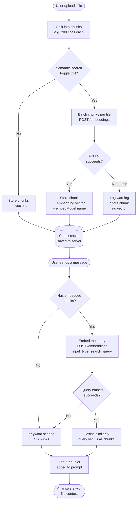

# USAi Chat — Embeddings & Semantic Search Guide

> **Audience:** End users *and* administrators.  
> Part of the [User Guide](USER_GUIDE.md) — start there for general setup.

---

## Table of Contents

1. [What Are Embeddings?](#1-what-are-embeddings)
2. [Two Ways to Search Files](#2-two-ways-to-search-files)
3. [When to Use Semantic Search](#3-when-to-use-semantic-search)
4. [Admin Setup](#4-admin-setup)
5. [Enabling the Toggle (Users)](#5-enabling-the-toggle-users)
6. [How It Works End-to-End](#6-how-it-works-end-to-end)
7. [What You See in the UI](#7-what-you-see-in-the-ui)
8. [Vector Caching & Model Changes](#8-vector-caching--model-changes)
9. [Graceful Fallback](#9-graceful-fallback)
10. [Troubleshooting](#10-troubleshooting)
11. [FAQ](#11-faq)

---

## 1. What Are Embeddings?

When you upload a text file, USAi splits it into **chunks** and then needs to
decide which chunks are most relevant to your question before inserting them
into the prompt.

**Keyword matching** (the default) scans for shared words.  It works well when
your question uses the same vocabulary as the file — but it misses meaning:

| Your question | File says | Keyword match? |
|---------------|-----------|----------------|
| "What was the annual revenue?" | "The company earned $4 M in yearly income." | ❌ "revenue" ≠ "income" |
| "How do cars perform?" | "Automotive fuel efficiency improved." | ❌ "cars" ≠ "automotive" |

**Embeddings** convert text into a list of numbers — called a **vector** — that
encodes *meaning*.  Sentences with similar meanings end up with similar vectors,
even if they share no words.

```
"annual revenue"  →  [0.21, -0.08, 0.67, ...]
"yearly income"   →  [0.20, -0.07, 0.65, ...]   ← very close!

"basketball score" → [-0.31, 0.44, -0.12, ...]  ← far away
```

USAi measures how close two vectors are using **cosine similarity** — a number
from −1 (opposite) to 1 (identical in meaning).  The top-scoring chunks are
the ones added to your prompt.

> 💡 **Plain-English summary:** Keyword search asks *"do you share words?"*
> Semantic search asks *"do you share meaning?"*

---

## 2. Two Ways to Search Files

| | **Keyword (default)** | **Semantic (embeddings)** |
|---|---|---|
| **How it works** | Counts shared words between your query and each chunk | Compares meaning-vectors via cosine similarity |
| **Setup needed** | None — always available | Requires `EMBED_MODEL` in `.env` |
| **Speed** | Instant (pure in-browser math) | Small extra call per upload + per query |
| **Best for** | Exact terms, code, config files, short files | Natural-language queries, mixed terminology, long documents |
| **Misses** | Paraphrases, synonyms | Rare: very short or highly structured text |
| **Toggle** | Always on | Semantic search toggle (only shown when configured) |

---

## 3. When to Use Semantic Search

### ✅ Turn it on when…

- Your documents use different terminology than you do  
  *(e.g., a legal contract uses "indemnification" but you ask about "liability")*
- You're asking natural-language questions over large documents  
  *(e.g., an annual report, a research paper, a design doc)*
- You have multiple files with overlapping topics and want the right one to surface
- You're uploading logs or notes written by different people with different phrasing

### ⛔ Leave it off (or don't bother) when…

- Your files are small (< a few hundred lines) — keyword matching is fast and
  accurate enough
- You're searching for exact identifiers: error codes, function names, SQL column
  names, IP addresses
- You're uploading code files and asking for a specific method or variable name
- No `EMBED_MODEL` is configured — the toggle won't appear anyway

---

## 4. Admin Setup

> **Role: Server admin / `.env` configurator**

### How the embeddings URL is built

USAi uses **the same `BASE_URL` for both chat and embeddings** — there is no
separate URL to configure.

The server constructs the embeddings endpoint automatically:

```
<BASE_URL>/api/v1/embeddings
```

For example, if your `.env` has `BASE_URL=https://api.novita.ai/v3/openai`, the
embeddings request goes to:

```
https://api.novita.ai/v3/openai/api/v1/embeddings
```

This means **you only need `BASE_URL` set once** and both chat and embeddings use
it.  If your provider's embeddings endpoint lives at a different path than
`/api/v1/embeddings`, embeddings will fail — check your provider's OpenAI-compat
documentation to confirm the path.

### Step 1 — Choose an embedding model

You need an embedding model exposed by the same API gateway you use for chat.
Common options:

| Provider / gateway | Model ID to set |
|--------------------|----------------|
| NovitaAI | `nomic-embed-text` |
| Cohere via OpenAI-compat gateway | `cohere/embed-english-v3.0` |
| LM Studio (local) | `nomic-embed-text` |
| OpenAI | `text-embedding-3-small` |
| Any OpenAI-compat endpoint | Whatever `GET /api/v1/models` lists |

### Step 2 — Add to `.env`

```bash
# BASE_URL is already required for chat — no second URL needed.
# The embeddings endpoint is built automatically as: <BASE_URL>/api/v1/embeddings
BASE_URL=https://api.novita.ai/v3/openai   # (already set for chat — shown for clarity)

# Required — the model ID to use for all embedding calls
EMBED_MODEL=nomic-embed-text

# Optional — Cohere/NovitaAI input_type; default is "search_document"
# Leave as-is unless your model requires a different value
EMBED_INPUT_TYPE=search_document
```

### Step 3 — Restart the server

```bash
# Stop the current server (Ctrl+C), then:
.venv/bin/python server.py
```

### Step 4 — Verify

```bash
curl -s http://localhost:8000/config | python3 -m json.tool | grep has_embeddings
```

Expected output:
```json
"has_embeddings": true
```

If you see `false`, double-check that both `BASE_URL` and `EMBED_MODEL` are
set and non-empty in `.env`.

> 🔒 **Security note:** The model name and API key are **never sent to the
> browser**. The browser posts raw text to `/embeddings`; `server.py` injects
> the model ID and key before forwarding to the upstream API.

---

## 5. Enabling the Toggle (Users)

Once an admin has configured `EMBED_MODEL`, the **Semantic search** toggle
appears in the **File Uploads** section of the settings sidebar.

1. Open the **File Uploads** section.
2. Find the **Semantic search** toggle and turn it **on**.
3. Upload (or re-upload) your files — semantic search is applied at upload time.

> **Why re-upload?** Embedding vectors are generated when a file is processed.
> Files uploaded before the toggle was on will use keyword matching unless
> you re-upload them.

---

## 6. How It Works End-to-End



### Key points in the flow

| Step | Detail |
|------|--------|
| **Chunking** | Each text file is split into overlapping chunks (default: 200 lines). Size is configurable in the File Uploads panel. |
| **Batch embed on upload** | All chunks for one file are sent in a single `/embeddings` call (batched in groups of ≤ 96 texts to stay within model limits). |
| **Cache** | Chunk text + vector + `embedModel` name are saved to a server-side cache. Re-opening the same session does **not** re-embed. |
| **Query embed** | At query time, your message is sent to `/embeddings` with `input_type=search_query` — a different signal that tells Cohere-style models this is a question, not a document. |
| **Cosine ranking** | Each chunk gets a score from −1 to 1; the top-K (default 5) are injected into the prompt. |
| **Automatic fallback** | Any failure (API down, no vectors, toggle off) silently drops back to keyword scoring. You always get an answer. |

---

## 7. What You See in the UI

### After uploading files

A status line below the upload button shows the active mode:

```
Loaded 42 chunks from 2 file(s) (using semantic search)
```
or
```
Loaded 42 chunks from 2 file(s) (using keyword matching)
```

### Debug Logs

Click **Debug Logs** (top-right) and filter by component `embeddings` to see:

| Log entry | What it means |
|-----------|--------------|
| `Embedding N chunk(s) for "filename"` | Chunks are being embedded — normal |
| `Embedded N chunk(s) for "filename"` | Embedding succeeded |
| `Embedding failed for "filename" — falling back to keyword matching` | API error; keyword matching is active |
| `Semantic retrieval for "your query…"` | A query embedding was made and cosine ranking was used |
| `Query embedding failed — falling back to keyword scoring` | Query embed failed; keyword fallback active |

### Tool calling mode

When **Tool calling** is on and semantic search is enabled, the built-in
`search_uploaded_files` tool also uses cosine ranking automatically.

---

## 8. Vector Caching & Model Changes

Vectors are cached alongside chunk text in the server-side chunk cache. Each
chunk records the `embedModel` that produced its vector.

**What happens when you change `EMBED_MODEL`:**

- On next upload, USAi detects that the cached `embedModel` differs from the
  current one.
- Affected chunks are **automatically re-embedded** with the new model.
- You don't need to manually clear the cache.

**What happens when you restore a session:**

- Cached chunks with valid vectors are restored as-is — no re-embed call.
- If the cache is missing or stale, upload the files again to regenerate vectors.

---

## 9. Graceful Fallback

USAi is designed to **always return an answer**, even when embeddings are
unavailable.  Fallback to keyword matching happens silently in any of these
cases:

| Situation | Result |
|-----------|--------|
| `EMBED_MODEL` not set in `.env` | Semantic search toggle hidden; keyword only |
| Semantic search toggle is off | Keyword matching, no API calls |
| `/embeddings` API call fails (network, auth, rate limit) | Warning logged; keyword fallback |
| Query embedding call fails | Warning logged; keyword fallback for that message |
| Chunks have no stored vectors (uploaded before toggle was on) | Keyword fallback for those chunks |

No error message is shown to the user — the chat simply continues normally.

---

## 10. Troubleshooting

### "Semantic search" toggle doesn't appear

The toggle is hidden when `/config` returns `has_embeddings: false`.

**Checklist:**
- [ ] `EMBED_MODEL=` is set to a non-empty value in `.env`
- [ ] `BASE_URL=` is also set
- [ ] Server was **restarted** after editing `.env`
- [ ] Verify: `curl http://localhost:8000/config` → `has_embeddings` is `true`

---

### Files still using keyword matching after enabling toggle

Embedding vectors are generated **at upload time**.  If you enabled the toggle
after uploading files, re-upload them.

---

### Embeddings API error in Debug Logs

Look for `POST /embeddings failed: <status>`:

| HTTP Status | Likely cause | Fix |
|-------------|--------------|-----|
| `400` | `EMBED_MODEL` not set, or model ID unknown | Verify `EMBED_MODEL` in `.env` |
| `401` / `403` | Wrong or expired API key | Check `API_KEY` in `.env`; restart |
| `413` | Payload too large | Reduce **Chunk size** in File Uploads settings |
| `502` | SSRF guard rejected the upstream URL | Check `BASE_URL` — must be a public hostname, not `localhost`/`127.x.x.x` |
| `5xx` | Provider error | Retry; check provider status page |

---

### Slow uploads

Embedding 100+ chunks adds one or more API round-trips (each batch of ≤ 96
chunks = one call).  For very large files:

- Increase **Chunk size** in settings (fewer chunks = fewer calls).
- Reduce **Top chunks** — the AI reads fewer chunks per message.
- Or leave semantic search off for that session and use keyword matching.

---

## 11. FAQ

**Q: Does semantic search cost more?**  
A: It uses your embedding model's API — check your provider's pricing for
embedding tokens. A single `/embeddings` call per upload + one per query message.
For most use cases the cost is negligible.

**Q: Is my content sent anywhere new?**  
A: Chunk text is sent to your existing API provider (the same one used for chat)
via the `POST /embeddings` endpoint. Nothing goes to a third party that isn't
already receiving your chat messages. Your API key stays server-side.

**Q: Which embedding models work?**  
A: Any model exposed as `POST /api/v1/embeddings` on your `BASE_URL` in
OpenAI-compatible format (i.e., responds with `{ "data": [{ "embedding": [...] }] }`).
Cohere-style `input_type` is forwarded when set.

**Q: What if my model doesn't support `input_type`?**  
A: The server forwards it as-is. Most OpenAI-compat endpoints silently ignore
unknown fields. If you get a `400`, try clearing `EMBED_INPUT_TYPE` in `.env`
(leave the value blank).

**Q: Can I use a different embedding model than the chat model?**  
A: Yes — `EMBED_MODEL` is independent of the chat model you select in the UI.
You could chat with Llama 4 while embedding with `nomic-embed-text`, for example,
as long as both are available on the same `BASE_URL`.

**Q: Does the Semantic search setting persist across reloads?**  
A: Yes — like all other settings, it's saved in your browser and restored
automatically.

**Q: What does `input_type=search_query` vs `search_document` mean?**  
A: Some embedding models (notably Cohere embed-v3 and compatible ones) produce
*asymmetric* embeddings — document vectors and query vectors are optimised
separately.  USAi automatically uses `search_document` when embedding file
chunks at upload time, and `search_query` when embedding your question at query
time.  For models that don't distinguish (e.g. OpenAI `text-embedding-3-small`),
the field is simply ignored.

---

*For general app setup and usage, see [User Guide](USER_GUIDE.md).*  
*For technical implementation details, see [docs/specs/embeddings-rag.md](specs/embeddings-rag.md).*
