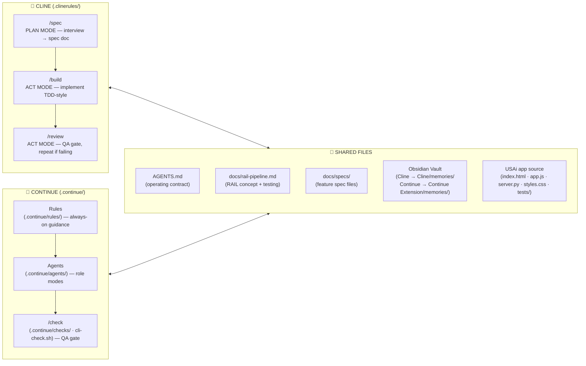

# Cline & Continue Harness — Workflow Diagram

Both harnesses implement the same **RAIL pipeline** but in different ways.
They operate independently yet read from the same shared files.

## Legend

| Symbol | Meaning |
|--------|---------|
| `🤖 CLINE` | Cline VS Code extension — slash-command workflows in `.clinerules/` |
| `🔧 CONTINUE` | Continue VS Code extension — rules/checks/agents in `.continue/` |
| `🔗 SHARED` | Files both harnesses read from (neither owns them exclusively) |
| `↔` | Reads from **and** writes to (e.g. Cline's `/spec` writes `docs/specs/`, Continue's `/check` validates the same specs) |

## Key differences

| | Cline | Continue |
|-|-------|----------|
| **Workflow model** | Plan/Act toggle + slash-command workflows | Always-on rules + `/check` command |
| **QA gate** | `/review` workflow | `/check` (VS Code) or `scripts/cli-check.sh` (CLI) |
| **Spec files** | Written by `/spec`, consumed by `/build` | Consumed by checks |
| **Memory subfolder** | `Cline/memories/` | `Continue Extension/memories/` |
| **Private config** | `.clinerules/` | `.continue/` |

## References

- [`docs/ORGANIZATION.md`](ORGANIZATION.md) — three-concern map (USAi app / Cline / Continue)
- [`docs/rail-pipeline.md`](rail-pipeline.md) — shared RAIL concept + testing strategy
- [`docs/tooling/cline.md`](tooling/cline.md) — Cline harness detail
- [`docs/tooling/continue.md`](tooling/continue.md) — Continue harness detail
- `AGENTS.md` — shared operating contract
