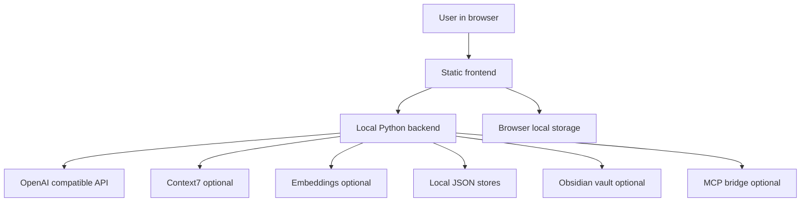

# Product Requirements Document — USAi Chat

## 1. Document purpose

This product requirements document describes USAi Chat as it exists in this repository today. It is meant to help a person understand what the product does, who it is for, which behavior is already implemented, which guardrails matter, and how future work should stay aligned.

Primary project sources used for this version:

- [README.md](README.md)
- [docs/USER_GUIDE.md](docs/USER_GUIDE.md)
- [docs/ARCHITECTURE.md](docs/ARCHITECTURE.md)
- [docs/ORGANIZATION.md](docs/ORGANIZATION.md)
- [docs/rail-pipeline.md](docs/rail-pipeline.md)
- [docs/principles.md](docs/principles.md)
- [backlog.md](backlog.md)
- [CHANGELOG.md](CHANGELOG.md)
- [frontend/index.html](frontend/index.html)
- [frontend/app.js](frontend/app.js)
- [frontend/styles.css](frontend/styles.css)
- [backend/server.py](backend/server.py)
- [backend/proxy_handlers.py](backend/proxy_handlers.py)
- [backend/session_handlers.py](backend/session_handlers.py)
- [backend/memory_handlers.py](backend/memory_handlers.py)
- [backend/mcp_handlers.py](backend/mcp_handlers.py)
- [backend/projects_handlers.py](backend/projects_handlers.py)

## 2. Product overview

USAi Chat is a lightweight local chat workspace for using OpenAI-compatible model APIs through a browser. It combines a static vanilla JavaScript frontend with a small Python backend. The frontend is made of [frontend/index.html](frontend/index.html), [frontend/app.js](frontend/app.js), and [frontend/styles.css](frontend/styles.css). The backend starts from [backend/server.py](backend/server.py) and delegates route behavior to split handler modules under [backend/](backend/).

The app is designed for a single local operator. It serves the browser UI, keeps API keys on the server, proxies model requests, and stores useful local state such as chats, sessions, project metadata, file chunks, logs, raw upstream responses, and optional Obsidian memory notes.

The product is not a hosted service. It is a local-first AI workspace that favors inspectable files, small dependencies, explicit configuration, strong secret handling, and predictable validation over a large framework stack.

## 3. Product vision

USAi Chat should let a user run a private AI workspace that can:

- Chat with multiple OpenAI-compatible model providers from one local interface.
- Keep sensitive API credentials out of the browser.
- Stream responses and support practical chat actions such as stop, copy, edit, resend, and regenerate.
- Organize work into projects with shared instructions, shared files, project chats, and scoped memory behavior.
- Use uploaded files, project files, image attachments, Obsidian memories, Context7 documentation, and optional tools to improve answers.
- Preserve useful knowledge in local files that the user can inspect and back up.
- Stay simple enough to run, test, debug, and modify without a frontend build step.

## 4. Problems and opportunities

| Area | Problem today | Product opportunity |
|------|---------------|---------------------|
| Local model access | Users often need one safe interface for several model providers. | Provide a configurable OpenAI-compatible proxy with model selection and smart parameter handling. |
| Secret handling | Browser-only chat apps can expose API keys. | Keep secrets server-side and return only safe configuration flags to the frontend. |
| Context continuity | Useful context is often lost between chats or mixed across topics. | Provide persisted sessions, projects, instructions, shared files, and Obsidian-backed memory. |
| Knowledge retrieval | Users need answers grounded in their own files and notes. | Support file chunking, keyword retrieval, optional embeddings, and memory recall. |
| Debuggability | Local AI calls can fail for provider, configuration, or request-shape reasons. | Make logs, raw captures, health information, and visible status notes part of the product. |
| Maintainability | AI app prototypes often become hard to inspect or validate. | Keep a zero-build runtime posture and govern changes through the RAIL workflow. |

## 5. Goals and non-goals

### 5.1 User goals

- Start the app locally after setting environment variables.
- Send messages and receive streamed assistant responses.
- Stop generation when a response is no longer useful.
- Choose a model directly or let the router pick a model tier.
- Set prompt, reasoning, output, and generation controls without editing source files.
- Upload images for vision-capable models.
- Upload files and reuse relevant chunks as conversation context.
- Create projects for different topics, clients, or workstreams.
- Add project instructions that are included in project chats.
- Save and recall long-term memory through an Obsidian vault when configured.
- Use logs and raw response capture to diagnose problems.

### 5.2 Product goals

- Keep the runtime small, auditable, and easy to operate locally.
- Protect API keys and other secrets from the browser and logs.
- Support advanced chat workflows while staying plain HTML, CSS, JavaScript, and Python.
- Store local data in transparent file formats.
- Keep user-facing behavior aligned with documentation and tests.
- Preserve the separation between the USAi Chat app, the Continue harness, and the Cline harness.

### 5.3 Non-goals for the current product

- Public multi-user software as a service.
- Built-in user accounts, roles, or authentication.
- A required cloud database.
- A frontend framework or build pipeline.
- A general-purpose Obsidian editor.
- Unrestricted filesystem access.
- Unrestricted network proxying.
- Internet-facing production deployment without extra hardening.

## 6. Target users and personas

### 6.1 Local AI power user

A person who wants one private browser interface for several AI models.

Needs:

- Fast local startup.
- Clear model controls.
- Streaming replies.
- Persistent settings and chats.
- Safe API-key handling.

### 6.2 Developer or technical operator

A person who wants to inspect, debug, test, and extend the local app.

Needs:

- Plain source files.
- No frontend build step.
- Local logs and raw upstream response captures.
- A health endpoint and deterministic checks.
- Clear architecture and route boundaries.

### 6.3 Knowledge worker using projects

A person who separates work by topic, client, research area, or initiative.

Needs:

- Project workspaces.
- Project instructions.
- Shared project files.
- Project memory modes.
- Sidebar organization for pinned projects, projects, and chats.

### 6.4 Obsidian memory user

A person who treats Obsidian as long-term memory and wants selected chat knowledge saved as Markdown notes.

Needs:

- Controlled note writes into configured memory folders.
- Manual memory saving.
- Automatic memory recall when enabled.
- Optional semantic re-ranking through embeddings.
- Optional allowlisted Obsidian MCP bridge actions.

## 7. Current capabilities

### 7.1 Chat experience

| ID | Requirement | Current behavior |
|----|-------------|------------------|
| CHAT-1 | The app shall provide a browser chat interface. | The page includes a sidebar, chat header, main chat area, composer, and optional debug panel. |
| CHAT-2 | The user shall be able to send messages from the composer. | Messages can be sent from the composer controls and keyboard shortcuts. |
| CHAT-3 | Assistant responses shall stream by default when the selected mode supports streaming. | Streaming replies render incrementally and can show a cursor while active. |
| CHAT-4 | The user shall be able to stop generation. | The send control becomes a stop action during active generation and preserves partial text. |
| CHAT-5 | Assistant messages shall render Markdown. | Replies support formatted text, headings, lists, links, blockquotes, code blocks, and copy buttons. |
| CHAT-6 | The user shall be able to copy useful output. | Message-level copy and code-block copy controls are available. |
| CHAT-7 | The user shall be able to edit and resend prior user messages. | Editing a prior user turn reruns the conversation from that point and removes later turns. |
| CHAT-8 | The user shall be able to regenerate assistant responses. | Regeneration reruns from the selected assistant turn and replaces later conversation state. |
| CHAT-9 | The UI shall show response metadata when available. | Message notes can show model, routing, tokens, reasoning tokens, tools, files, memory, and JSON status. |

### 7.2 Model selection and routing

| ID | Requirement | Current behavior |
|----|-------------|------------------|
| MODEL-1 | The app shall support OpenAI-compatible model APIs. | The backend proxies requests to the configured base URL. |
| MODEL-2 | The app shall provide model selection in the composer. | The composer includes a model selector populated from configured and provider-returned models. |
| MODEL-3 | The app shall support automatic model routing. | Router choices include Off, Auto, High, Medium, and Low. |
| MODEL-4 | The router shall classify request complexity. | The frontend uses message length, code indicators, and task keywords to select a tier. |
| MODEL-5 | The app shall support reasoning effort controls. | The composer includes Off, Low, Medium, and High reasoning options. |
| MODEL-6 | The app shall display reasoning evidence when available. | Thinking or reasoning blocks and reasoning token counts can appear when returned by the provider. |
| MODEL-7 | The app shall avoid known unsupported parameters. | Smart parameter exclusions omit settings that known model classes reject. |

### 7.3 Prompt, template, and generation settings

| ID | Requirement | Current behavior |
|----|-------------|------------------|
| PROMPT-1 | The user shall be able to set a per-chat system prompt. | Prompt settings persist locally and are included in chat requests. |
| PROMPT-2 | Project instructions shall layer before per-chat prompts. | Active project instructions are prepended to the effective system prompt. |
| PROMPT-3 | The user shall be able to manage generation settings. | Temperature and max-token settings can be provided or left blank. |
| PROMPT-4 | The app shall support reusable prompt templates. | Built-in and user-saved templates can be applied from the prompt template UI. |
| PROMPT-5 | The app shall persist user preferences locally. | Browser local storage keeps settings such as theme, sidebar state, model controls, and templates. |

### 7.4 Structured output

| ID | Requirement | Current behavior |
|----|-------------|------------------|
| JSON-1 | The user shall be able to request structured JSON output. | A structured-output setting guides the model toward JSON responses. |
| JSON-2 | The user shall be able to provide a schema. | The schema field validates JSON as the user edits it. |
| JSON-3 | The app shall report JSON validity. | Valid JSON can be pretty-printed and invalid JSON is marked as such. |
| JSON-4 | The app shall degrade gracefully if the provider returns prose. | The frontend attempts to recover JSON from response text or code fences. |

### 7.5 Tool calling and plugins

| ID | Requirement | Current behavior |
|----|-------------|------------------|
| TOOL-1 | The user shall be able to enable or disable tool calling. | Tool calling is controlled from the settings area. |
| TOOL-2 | Tools shall only appear when their prerequisites are met. | The frontend gates tools based on configuration, feature toggles, and available data. |
| TOOL-3 | The app shall support calculation. | A calculator tool is available for arithmetic. |
| TOOL-4 | The app shall support uploaded-file search. | File-search tools use chunks from uploaded files and project files. |
| TOOL-5 | The app shall support Context7 when configured. | Context7 can be called manually or through tool calling. |
| TOOL-6 | The app shall support Obsidian memory tools when configured. | Memory search and save tools are available when a vault is configured and memory is enabled. |
| TOOL-7 | The app shall support optional Obsidian MCP bridge actions. | Allowlisted bridge actions include vault listing, note movement, and tag rename behavior when enabled. |
| TOOL-8 | Tool use shall be visible to the user. | Status indicators and message notes show when tools are active or used. |

### 7.6 Context7 integration

| ID | Requirement | Current behavior |
|----|-------------|------------------|
| CTX-1 | The app shall optionally fetch external documentation context. | The backend proxies Context7 requests when configured. |
| CTX-2 | Context7 shall be safe to disable. | Missing configuration disables related UI/tool availability through feature flags. |
| CTX-3 | Context7 requests shall use server-side configuration. | Keys and base settings stay on the backend. |

### 7.7 File and image uploads

| ID | Requirement | Current behavior |
|----|-------------|------------------|
| FILE-1 | The user shall be able to attach images. | Pending image thumbnails appear near the composer and are included for vision-capable models. |
| FILE-2 | The user shall be able to remove pending images. | Pending image thumbnails include removal controls. |
| FILE-3 | The user shall be able to upload text-like files for retrieval. | Supported text-oriented uploads are chunked and searched for relevant context. |
| FILE-4 | The app shall support project files. | Project files persist across chats in the project and are searched with per-chat file chunks. |
| FILE-5 | The app shall chunk uploaded content. | Chunk size and top-chunk behavior are configurable. |
| FILE-6 | The app shall cache chunks locally. | Global and project-scoped chunk cache endpoints store and clear file chunks. |
| FILE-7 | The app shall support richer extraction when configured. | PDF and DOCX extraction are optional capabilities exposed through backend configuration. |

### 7.8 Chat history and sessions

| ID | Requirement | Current behavior |
|----|-------------|------------------|
| SESSION-1 | The active chat shall survive reloads. | The current conversation is saved to local JSON and restored. |
| SESSION-2 | The user shall be able to start a new chat. | New chat archives the current chat and clears the active one. |
| SESSION-3 | Archived chats shall be listed. | Sidebar chat history shows saved sessions. |
| SESSION-4 | The user shall be able to restore sessions. | Selecting a session loads and renders it. |
| SESSION-5 | The user shall be able to delete sessions. | Session deletion removes selected archived session files. |
| SESSION-6 | The app shall support import and export workflows. | Session export and guarded import behavior preserve conversations in JSON form. |
| SESSION-7 | Legacy sessions shall remain usable. | Sessions without project identifiers are treated as normal ungrouped chats. |

### 7.9 Projects and workspaces

| ID | Requirement | Current behavior |
|----|-------------|------------------|
| PROJ-1 | The user shall be able to create named projects. | Projects are created from the sidebar modal with name, memory mode, instructions, and optional files. |
| PROJ-2 | The user shall be able to open projects. | Opening a project sets the active project context. |
| PROJ-3 | The user shall be able to rename projects. | Project updates support name changes. |
| PROJ-4 | The user shall be able to pin and unpin projects. | Pinned projects appear in a dedicated sidebar section. |
| PROJ-5 | The user shall be able to delete projects safely. | Deletion removes project metadata and project chunk cache, clears project membership from sessions, and preserves Obsidian notes. |
| PROJ-6 | The user shall be able to change a project's memory mode after creation. | Memory mode is chosen at creation and can be updated later via project settings (PUT /projects/<id>); the new mode takes effect immediately because scope is resolved per-request. |
| PROJ-7 | Projects shall support instructions. | Project instructions are included before per-chat prompts in project chats. |
| PROJ-8 | Projects shall support shared files. | Project file chunks are saved under project-scoped chunk cache storage. |
| PROJ-9 | The sidebar shall organize work clearly. | Sidebar sections separate pinned items, projects, and chats. |

### 7.10 Obsidian long-term memory

| ID | Requirement | Current behavior |
|----|-------------|------------------|
| MEM-1 | The app shall optionally use Obsidian as long-term memory. | The vault path and memory subdirectory are configured through environment variables. |
| MEM-2 | Memory reads and writes shall stay inside approved folders. | Backend memory handlers resolve and constrain file access to configured memory directories. |
| MEM-3 | The user shall be able to save messages manually. | A Remember action can save useful content as a Markdown note. |
| MEM-4 | The app shall support automatic recall. | When enabled, memory search can run before a message and inject relevant notes. |
| MEM-5 | The model shall be able to use memory tools. | Search and save memory tools are exposed when memory and tools are enabled. |
| MEM-6 | Memory search shall work without embeddings. | Keyword matching is the baseline search method. |
| MEM-7 | Memory search may use embeddings when configured. | Embedding-based cosine similarity can re-rank memory results. |
| MEM-8 | Project memory shall support default and project-only scopes. | Default mode searches global plus project memory. Project-only searches only project memory. |
| MEM-9 | Project memory saves shall target project memory when a project is supplied. | Both default and project-only project saves write to the project memory directory. |
| MEM-10 | Project deletion shall not delete vault memory. | Project delete preserves Obsidian notes. |

### 7.11 Debugging, logs, and observability

| ID | Requirement | Current behavior |
|----|-------------|------------------|
| LOG-1 | The app shall expose live debug logs in the UI. | The Debug Logs panel includes live log viewing, levels, search, and clearing. |
| LOG-2 | The backend shall keep structured in-memory logs. | Server log entries include timestamp, level, component, message, and details. |
| LOG-3 | The backend shall optionally persist logs. | Persisted JSONL log files are enabled through configuration. |
| LOG-4 | The UI shall support persisted log viewing. | The debug panel includes a Log Files tab for listing and reading persisted logs. |
| LOG-5 | Runtime logs shall support later review. | Log analyzer scripts help summarize problems and feed RAIL review. |
| LOG-6 | Logs shall avoid secrets. | Logging rules and proxy code avoid echoing sensitive credentials. |

### 7.12 Raw upstream response capture

| ID | Requirement | Current behavior |
|----|-------------|------------------|
| RAW-1 | The app shall optionally capture upstream responses. | Capture is controlled by configuration and stores local records. |
| RAW-2 | Capture shall support normal and streaming responses. | Non-streaming response bodies and accumulated streaming chunks can be captured. |
| RAW-3 | The user shall be able to browse captures. | Raw-response endpoints support listing and reading captures. |
| RAW-4 | The user shall be able to delete captures. | Raw-response endpoints support single delete and clear-all behavior. |
| RAW-5 | Captures shall not include API keys. | Authorization secrets are excluded from stored capture metadata and bodies. |

### 7.13 Accessibility and visual design

| ID | Requirement | Current behavior |
|----|-------------|------------------|
| A11Y-1 | Controls shall support keyboard use. | Interactive elements are reachable and visible focus styles are defined. |
| A11Y-2 | Icon-only controls shall be understandable to assistive technology. | Controls use labels, titles, or state text where needed. |
| A11Y-3 | The UI shall respect reduced-motion preferences. | Reduced-motion CSS disables nonessential animation. |
| A11Y-4 | The interface shall support light and dark themes. | Theme tokens and dark-mode variables define both appearances. |
| UI-1 | Primary message controls shall stay near the composer. | Model, router, reasoning, attachment, and send controls live in the composer area. |
| UI-2 | Advanced settings shall not crowd the main chat. | Settings are grouped in sidebar sections and hidden compatibility controls remain out of the main flow. |
| UI-3 | The UI shall be polished but inspectable. | Styling uses plain CSS variables, responsive layout rules, shadows, rounded surfaces, and motion tokens. |

## 8. Functional requirements

| ID | Requirement |
|----|-------------|
| FR-1 | Serve the static frontend locally. |
| FR-2 | Load runtime configuration from environment variables. |
| FR-3 | Return only non-secret browser configuration and feature flags. |
| FR-4 | Proxy model, model-list, embedding, and Context7 requests when configured. |
| FR-5 | Support streaming and non-streaming chat completions. |
| FR-6 | Inject authorization server-side for configured API calls. |
| FR-7 | Persist the active chat and archived sessions locally. |
| FR-8 | Create, list, update, pin, and delete projects. |
| FR-9 | Store project instructions, immutable memory mode, and project metadata. |
| FR-10 | Store and retrieve global and project-scoped chunk cache data. |
| FR-11 | Search and save Obsidian memory notes when a vault is configured. |
| FR-12 | Support optional Obsidian MCP bridge operations through an allowlisted backend bridge. |
| FR-13 | Receive frontend logs and expose backend logs to the UI. |
| FR-14 | Persist log files when configured. |
| FR-15 | Capture, list, read, delete, and clear raw upstream responses when configured. |
| FR-16 | Preserve legacy data where possible when newer project fields are absent. |

## 9. Backend and API requirements

### 9.1 Backend responsibilities

The backend shall:

- Serve files from the static frontend.
- Load safe runtime settings from environment variables.
- Keep secrets server-side.
- Proxy OpenAI-compatible API traffic to the configured upstream.
- Support streaming response relay through the local server.
- Support optional Context7 and embeddings proxy endpoints.
- Provide local endpoints for chats, sessions, chunks, projects, memory, logs, raw captures, and MCP bridge operations.
- Sanitize paths, project identifiers, and upstream URLs before using them.
- Keep route behavior modular through split handler modules.

### 9.2 Current backend module boundaries

| Module | Responsibility |
|--------|----------------|
| [backend/server.py](backend/server.py) | Server entrypoint, configuration, routing scaffold, shared helpers, static serving, and request-handler composition. |
| [backend/proxy_handlers.py](backend/proxy_handlers.py) | API proxying, Context7, embeddings, and raw response capture endpoints. |
| [backend/session_handlers.py](backend/session_handlers.py) | Active chat history, archived sessions, chunk cache, live logs, and persisted log files. |
| [backend/memory_handlers.py](backend/memory_handlers.py) | Obsidian memory list, search, read, and save behavior, including project memory scopes. |
| [backend/mcp_handlers.py](backend/mcp_handlers.py) | Optional Obsidian MCP bridge endpoints and request limits. |
| [backend/projects_handlers.py](backend/projects_handlers.py) | Project create, list, update, delete, pinning, instructions, and memory-mode metadata. |

### 9.3 Endpoint groups

| Group | Capabilities |
|-------|--------------|
| Configuration | Browser-safe config and health/status information. |
| Models | Upstream model list retrieval. |
| Proxy | OpenAI-compatible API proxying for streaming and non-streaming requests. |
| Context and embeddings | Optional Context7 and embedding request proxying. |
| Sessions | Active chat, archived sessions, session restore, deletion, and import/export workflows. |
| Chunk cache | Global and project-scoped file chunk persistence. |
| Projects | Project creation, listing, updates, pinning, instructions, memory mode, and deletion. |
| Memory | Obsidian memory listing, searching, reading, and saving. |
| Logs | In-memory logs, log clearing, persisted log listing, and persisted log reading. |
| Raw responses | Capture listing, reading, deleting, and clearing. |
| MCP bridge | Allowlisted Obsidian bridge actions when enabled. |

## 10. Data and local persistence expectations

| Store | Purpose | Expected format or location |
|-------|---------|-----------------------------|
| Active chat history | Restore the current chat after reload. | Local JSON file. |
| Archived sessions | Preserve older chats and optional project membership. | JSON files under the session store. |
| Browser settings | Preserve UI and user preferences. | Browser local storage. |
| Global chunk cache | Reuse per-chat or legacy uploaded file chunks. | JSON files. |
| Project chunk cache | Reuse files shared inside a project. | JSON files under project-scoped directories. |
| Project metadata | Store project name, pinning, instructions, immutable memory mode, and timestamps. | JSON files under the project metadata store. |
| Obsidian global memory | Store long-term global notes. | Markdown notes with YAML frontmatter in the configured app memory folder. |
| Obsidian project memory | Store project-scoped notes. | Markdown notes with YAML frontmatter in project memory folders. |
| Runtime logs | Show recent frontend and backend events. | In-memory records and optional JSONL files. |
| Raw upstream captures | Debug provider responses. | Opt-in local capture records. |

Persistence expectations:

- Local data should be human-readable where practical.
- Writes should be create-only or guarded when overwriting would risk data loss.
- Project deletion should remove project metadata and project chunks, clear project membership from sessions, and preserve chats and Obsidian memory notes.
- Memory note writes should be confined to the configured vault subfolders.
- Raw captures and logs should be treated as potentially sensitive local diagnostic artifacts even when secrets are excluded.

## 11. Non-functional requirements

| ID | Requirement | Current expectation |
|----|-------------|--------------------|
| NFR-1 | The app shall run locally with minimal setup. | Users run the Python server from the virtual environment or use Docker Compose. |
| NFR-2 | The frontend shall remain zero-build. | No frontend framework, bundler, or build command is required. |
| NFR-3 | Runtime dependencies shall stay small. | Backend runtime is Python standard library plus the environment-loading dependency used by the project. |
| NFR-4 | The app shall be inspectable. | Core behavior lives in plain source files and local data files. |
| NFR-5 | The app shall fail gracefully when optional integrations are missing. | Feature flags disable unavailable memory, Context7, embeddings, MCP, logging, or capture behavior. |
| NFR-6 | The app shall support deterministic validation. | Repository checks cover syntax, unit tests, coverage, security scans, and documentation consistency. |
| NFR-7 | The UI shall remain responsive and usable on common desktop layouts. | CSS includes responsive layout, sidebar collapse behavior, and reduced-motion support. |
| NFR-8 | Observability shall be built into normal operation. | Live logs, persisted logs, raw captures, status notes, and analyzer scripts support troubleshooting. |

## 12. Security and privacy constraints

| ID | Requirement | Current mechanism |
|----|-------------|-------------------|
| SEC-1 | API keys shall not be exposed to the browser. | The backend injects authorization headers and browser config returns only safe flags. |
| SEC-2 | Config endpoints shall not return secret values. | Browser configuration includes non-secret fields and boolean feature indicators. |
| SEC-3 | Secrets shall not be committed. | Environment files are ignored and security scanning is available. |
| SEC-4 | Upstream URLs shall be protected from server-side request forgery. | Configured upstream URLs are checked before proxying. |
| SEC-5 | Filesystem endpoints shall reject path traversal. | Paths are resolved and constrained to intended roots. |
| SEC-6 | Project identifiers shall be sanitized. | Project IDs reject empty, hidden, or traversal-shaped values before path use. |
| SEC-7 | Obsidian memory access shall be scoped. | Memory handlers read and write only inside configured memory directories. |
| SEC-8 | MCP bridge operations shall be allowlisted and optional. | Bridge endpoints are disabled unless configured and restrict request behavior. |
| SEC-9 | Logs and raw captures shall avoid secrets. | Proxy, logging, and capture behavior avoid storing authorization values. |
| SEC-10 | Public deployment requires extra hardening. | The documented default posture is local operation, not open internet exposure. |

## 13. UX principles

- Keep the main job simple: type a message, choose useful context, send, and read the answer.
- Put high-frequency controls near the message composer.
- Keep advanced settings available but not visually dominant.
- Show the user what context affected an answer, including files, memory, tools, routing, model, and JSON status where available.
- Disable or hide features that are not configured instead of letting the user discover failure late.
- Preserve user work automatically and visibly.
- Make destructive actions clear, especially deleting sessions, clearing logs, clearing captures, or deleting projects.
- Respect keyboard navigation, visible focus, readable contrast, and reduced-motion preferences.
- Keep visual polish in plain CSS so the interface remains easy to inspect and adjust.

## 14. Technical constraints

- The frontend must remain static vanilla HTML, CSS, and JavaScript.
- The backend must remain small Python code with minimal runtime dependencies.
- The app must not require a frontend build step.
- Dev and continuous-integration tooling may use extra packages when they do not ship into the runtime app.
- OpenAI-compatible behavior should be implemented through backend proxy endpoints, not by exposing secrets to the browser.
- Optional integrations must be configuration-gated.
- New endpoints must follow existing route, validation, logging, and security patterns.
- Behavior changes should include tests when they affect code paths.
- Documentation should change with user-visible behavior, security posture, persistence changes, endpoint changes, or workflow changes.
- The USAi Chat app, Continue harness, and Cline harness must keep separate memory destinations and responsibilities.

## 15. Success metrics

### 15.1 User-facing success indicators

- A configured user can start the app locally and complete a first chat without editing frontend code.
- The browser never receives configured API secrets.
- Streaming, stop, copy, edit, resend, regenerate, and Markdown rendering work in normal chat flows.
- Model routing selects a reasonable tier for simple, medium, and complex requests.
- Reasoning controls and metadata are visible when supported by the provider.
- Uploaded files and project files contribute visible context when relevant chunks are injected.
- Obsidian memory controls appear only when configured and can save or recall notes.
- Project deletion removes project metadata and project chunks while preserving chats and vault memory notes.
- Debug logs and raw captures help diagnose common provider and configuration problems.

### 15.2 Engineering success indicators

- The repository test runner passes for code changes.
- Coverage gates remain at or above documented thresholds.
- Security scan tooling completes without blocking findings for release work.
- Documentation consistency checks catch stale paths and key documentation drift.
- The app runs through the virtual environment and Docker Compose paths.
- Notable changes update the appropriate user guide, architecture docs, changelog, backlog, and PRD sections.
- RAIL workflow evidence stays clear enough for another agent or human to review.

## 16. Risks and assumptions

| Risk or assumption | Impact | Current mitigation or follow-up |
|--------------------|--------|---------------------------------|
| The app is local-first, not public-SaaS hardened. | Users may overestimate deployment safety. | Keep docs explicit and require extra hardening for public exposure. |
| Provider APIs differ in supported parameters and response metadata. | Requests can fail or omit expected fields. | Smart parameter exclusions and visible metadata reduce surprises. |
| Optional integrations can be misconfigured. | Memory, Context7, embeddings, MCP, logs, or capture features may be unavailable. | Feature flags gate UI and tool exposure. |
| Local stores can grow over time. | Sessions, chunks, logs, and captures may need cleanup. | Clear, delete, rotation, and housekeeping workflows exist for supported stores. |
| Logs and raw captures may include sensitive conversation content. | Local diagnostic files can expose private user data if shared. | Keep captures opt-in, exclude secrets, and treat diagnostic files as private. |
| Project memory mode labels must stay aligned across UI, docs, and backend behavior. | Users may misunderstand memory scope. | The PRD defines the intended current behavior: default searches global plus project memory; project-only searches project memory only; project saves target project memory. |
| Tool-calling flows can change streaming behavior. | Users may see different response timing when tools or structured output are active. | UI status and docs should continue explaining mode differences. |

## 17. Roadmap and backlog alignment

Current completed backlog and changelog themes reflected in this PRD:

- Backend module split into focused handler modules.
- Frontend and backend directory organization.
- Projects, including create/list/update/delete, pinning, project instructions, memory modes, and project files.
- Obsidian long-term memory and optional Obsidian MCP bridge.
- Embeddings-assisted memory search.
- Streaming chat plus tool-calling final-answer behavior.
- Raw upstream response capture, including streaming capture.
- Live logs, persisted log files, log viewer, and log analyzer workflow.
- Automatic model routing and refreshed model catalog behavior.
- Prompt templates.
- Accessibility, sidebar collapse, and premium UI polish.
- RAIL governance, coverage gates, security scans, doc-drift guards, and referenced-path checks.

Open or deferred backlog themes that remain outside the current product baseline:

- Custom user-defined tools.
- Side-by-side model comparison.
- Voice input and text-to-speech.
- Multi-server MCP connectors beyond the current optional Obsidian bridge pattern.
- Continued UX and UI SME refinements.
- Ongoing documentation and drift cleanup as behavior changes.

Roadmap changes should keep using the backlog as the near-term planning source, the changelog as the completed-work record, and this PRD as the current product contract.

## 18. Current-state product architecture

Plain-language flow:

1. The user opens the local browser UI.
2. The frontend sends safe requests to the local backend.
3. The backend adds server-side configuration and forwards allowed model requests to the upstream API.
4. The backend stores local state such as chats, sessions, projects, chunks, logs, and captures.
5. Optional integrations add Obsidian memory, Context7 documentation, embeddings, and MCP bridge behavior.

## 19. Release and validation requirements

For code changes, the project expects the established validation gates:

- Frontend JavaScript syntax checks.
- Backend Python syntax checks.
- JavaScript unit and behavior tests.
- Python unit and HTTP tests.
- Coverage gates for important backend and frontend behavior.
- Security scans for secrets, Python static analysis, and dependency vulnerabilities.
- Documentation and specification consistency checks where applicable.
- Manual smoke testing when behavior touches the running app.

For documentation-only changes like this PRD update, lightweight documentation validation is sufficient unless the change reveals a code or security issue.

## 20. Acceptance criteria for this PRD

This PRD is aligned when it:

- Identifies USAi Chat as a local static frontend plus small Python backend app.
- Names the current frontend and backend source boundaries.
- Covers target users, problems, opportunities, goals, and non-goals.
- Describes current capabilities across chat, models, prompts, structured output, tools, Context7, files, projects, memory, logs, raw captures, accessibility, and UI.
- Defines functional and non-functional requirements.
- States security and privacy constraints for secrets, configuration, upstream proxying, filesystem access, memory, MCP, logs, and captures.
- Describes observability and local persistence expectations.
- Explains technical constraints such as zero-build frontend and minimal runtime dependencies.
- Includes success indicators, risks, assumptions, and roadmap alignment.
- Avoids claiming deferred backlog items as current product behavior.
- Preserves accurate prior PRD content while removing stale ambiguity where implementation is now clear.

## 21. Source-of-truth maintenance

Update this PRD when a future change affects:

- Core user journeys.
- Security or privacy behavior.
- Runtime dependencies or architecture constraints.
- Persistence formats or locations.
- Public endpoints or feature flags.
- Project, memory, file, model, prompt, or tool behavior.
- Observability, logging, or raw capture behavior.
- Validation gates or acceptance criteria.
- Roadmap scope or backlog status that changes the current product contract.
